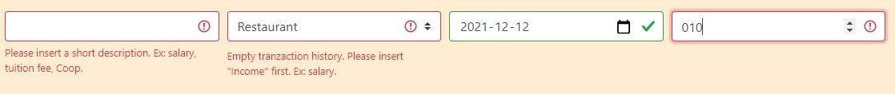
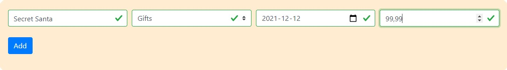

# Budgy

Budgy is an interactive front-end website for tracking users' financial data. Users' can keep track of their income and spending by manually add transactions. An updated current balance will be displayed, as well as a weekly balance and a monthly one. 
It loads some test data to demonstrate the website's capabilities by default. This website will be connected to a database that handles multiple users.

# Design Decisions
## Wireframe
The Wireframe for Budgy was produced using WireFlow. The wireframe's display is for mobile devices, and the final design has some changes that occurred during the development process.

The design is split into three significant parts.
* **dashboard** - this is where the user can see the current Balance, Currency, monthly and weekly expenses and set its spending limits on a weekly and monthly basis.
* **entry-form** - this is where the user registers the entries. 
* **entry-area** - this section displays all the entries. 

## Design choices
Typography: The font chosen is Roboto, sans-serif.

## Color palette
The chosen color scheme is based on blue, green, and lighter tones of beige and gray. This palette allows the user to focus on the content and creates a modern aspect for the website. Moreover, blue is traditionally associated with corporate uniformity and professionalism in the business industry.

# User Experience
## Features
Each section has different features designed to make the user experience more enjoyable. 

### Instruction button
When pressed, a modal window will pop up. The modal contains valuable information about the website's elements and expected interaction. 

The modal can be closed using `x-button` or `close-button` from the window. Outside click will also close the information window.

### Dashboard
It is designed to prompt the user with information about balance, currency, weekly and monthly expenses. 

**Balance** is defined as the sum of all income entries minus all expense entries. Balance's value will update with every new entry.

**Weekly balance** represents the expenses made in the current week, with Monday being the first day of the week.

 **Monthly balance** represents the sum of all costs in the current month. 

 **Currency** is a drop-down list with multiple currency types to choose from. Users can select one Currency that will be displayed next to Balance, Monthly, and Weekly balance. A new currency can be selected when the user press `reset`. 

The user can set its spending limit on a weekly and monthly basis. When the limit is exceeded, the value associated with it will be displayed in red. Here is an example where the **monthly**  and **weekly** limits were exceeded.

When the limit is reached, the user is allowed to increase it. If it is increased above the reported expenses, the red style will dynamically disappear.

### Entry Form
This structure is designed to allow the user to register entries. It is composed of 5 elements:
* **description** - entry description. The user is expected to briefly describe the type of income or expense, transaction place, or other information. This entry field validates the user's input by ensuring that at least one alphanumeric character is inserted. In case of invalid input, an error message appears to notify the user about the expected input.
* **category** - user can choose from `income, groceries, restaurant, beauty, health, leisure, gifts, transport, hobbies, shopping, bills, loans, housing`. 

The user's first entry is valid when `Income` is selected. `Income` is defined as the money received. All the other categories are expenses. To ensure a positive current balance, `Income` comes first. A category is needed for later entry filtering.
* **date** - the date when the entry was processed. This entry field does not allow inputs for future dates.
* **amount** - entry's amount. The user can add whole numbers or numbers with two decimal places using a comma character. 
* **add button** - when clicked, it triggers the form submission.
When the user presses the `add` button, the entry will be processed, and the form will be cleared to make room for a new request.
 

### Entry Area
This element displays all the entries submitted via the entry form. At this point, it is only for display. The intention is also to provide manipulation over the entries, like filtering capabilities, sorting. 

The entries from **income** category will always be displayed in green to make them more easily noticeable by the user. 

### Reset
The website also has a reset button. When this button is pressed, it will clear the dashboard, entry area, and the forms.

# Technologies used

- HTML5 - provides the core structure for the website.
- CSS - styling.
- Bootstrap - styling.
- Luxor JS library - for date manipulation.
- JavaScript - used to program the behavior of web page.
- Gitpod - used to deploy the website.
- Github - used to host and edit the website.

# Testing
The testing was performed in different ways, with emphasis on manual testing. Interactions and reviews with my mentor have brought to light some issues, which were solved. 

## Tools
The HTML and CSS code were tested using [W3C HTML Validator](https://validator.w3.org/), respectively [W3C CSS Validator](https://jigsaw.w3.org/css-validator/). JavaScript code was tested using [JSHint](https://jshint.com/).
A few bugs have been found during the development process, which was corrected.

### HTML result

### CSS result

### JavaScript result

### Lighthouse
This [tool](#https://developers.google.com/web/tools/lighthouse) was used to test the performance and accessibility. It provided useful information to improve accessibility and SEO during the creation process. Here are the final results:

## Manual testing
The testing targeted all the number and text input elements. 
* `description` was tested by inserting alphanumeric characters, only whitespaces, and non-alphanumeric characters, with the last two being correctly marked as invalid.
* `amount` was tested by inserting multiple combinations of valid and invalid numbers. The following values were inserted: `0, 0.00, 007, 100, 100.01, -100, -100.01`
* `monthly and weekly limits` were tested by inserting negative values, alphabetic characters, special characters, and white spaces.

## Responsiveness
The responsiveness was tested using three different tools:
- Chrome Developer Tools
- http://ami.responsivedesign.is/
- https://www.responsivedesignchecker.com/

## Compatibility
The website was tested on Chrome, Edge, Mozilla Firefox. The functionality and appearance remain unchanged between these three on any device size. 

## Fixed Bugs

During the development process, a series of errors popped up. 

- The user's ability to add negative values in the Amount form field showed a lack of defensive design. I solved this bug by using `min` and `oninput` attributes for `input`. 

- Another error in the same form field was that the user could add only whole numbers. This was solved by setting the `step` input attribute's value to 0.01. Numeric values with two decimals are allowed. 

- The user was able to introduce empty input in the `Description` form field. Problem fixed using Bootstrap validation classes `is-valid` and `is-invalid` to visually prompt the user. At least one alphanumeric character is requested. If not provided, an error message will appear. 

- I used the 'min' attribute to prevent negative values for `input type="number"` when setting the weekly and monthly limits. 

- The `current balance` was displayed with many decimals due to rounding errors. This was solved in JavaScript by only printing the first two decimals after `,` using `toFixed(2)`.

- During testing, a functional error emerged when calculating current week expenses. The week number in the year was inaccurate, and expenses were registered from Wednesday until next Tuesday. This bug was fixed in the currentWeeklyBalance function by using the `DataTime` data structure from the Luxon library. Properties `weekNumber` and `weekYear` were used to ensure the correct validation of user input in the week of the corresponding year.

## Known issues
1. Each field in the entry form is validated and prompted as invalid/valid while the user is typing, but data is not validated on the `add` button. If the user ignores the visual warnings, it will introduce invalid values in the table.
2. Input 0,00 is valid in the `Amount` entry field.

# Deployment

## Project deployment
  
The site was deployed to GitHub pages. The steps to deploy a site are:

1. In the GitHub repository, navigate to the Settings tab.
2. Once in Settings, navigate to the Pages tab on the left-hand side.
3. Under Source, select the branch to master/main, then click save.
4. The page will be automatically refreshed with a detailed ribbon display to indicate the successful deployment.
  
## To fork the repository on GitHub
  
  A copy of the GitHub Repository can be made by forking the GitHub account. This copy can be viewed, and changes can be made without affecting the original repository. Take the following steps to fork the repository:

  1. Log in to GitHub and locate the repository.
  2. Click on the "Fork" button, located on the right-hand side, to create a copy of the original repository in your GitHub account. 

## To create a local clone of this project
  

  Below are the detailed steps:

  1. Under the repository's name, click on the code tab.
  2. In the Clone with HTTPS section, click on the clipboard icon to copy the given URL.
   PRINT

   3. In your IDE of choice, open Git Bash.
   4. Change the current working directory to the location where you want the cloned directory to be made.
   5. Type git clone and paste the URL copied from GitHub.
   6. Press enter, and the local clone will be created.

# Credits

- Google Fonts 
- W3 Schools
- [This solution](https://stackoverflow.com/questions/32777184/html-input-for-positive-whole-numbers-only-type-number/32784911?noredirect=1#comment61101594_32784911) was implemented to the Amount field to accept only positive, whole numbers values.
- [This](https://stackoverflow.com/questions/7372067/is-there-any-way-to-prevent-input-type-number-getting-negative-values) was used to prevent negative values for weekly and monthly limits.
- CSS Tricks
- MDN WEB DOCS 
- coolors.co - used to create a color pallet
- Wire Flow Wireframe Design - was used to create the wireframe
- DelftStack (https://www.delftstack.com/howto/javascript/javascript-get-week-number/) - this was used as inspiration to get the current week of the year.
# Acknowledgements
 The site was completed as a Portfolio 2 Project piece for the Full Stack Software Developer (e-Commerce) Diploma at the Code Institute. Special thanks to my mentor, Precious Ijege, for the support and feedback.

The live link to the Github repository can be found here: https://antocim.github.io/budgy/.
