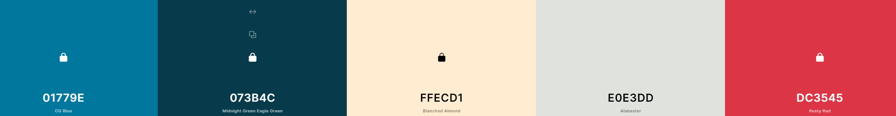
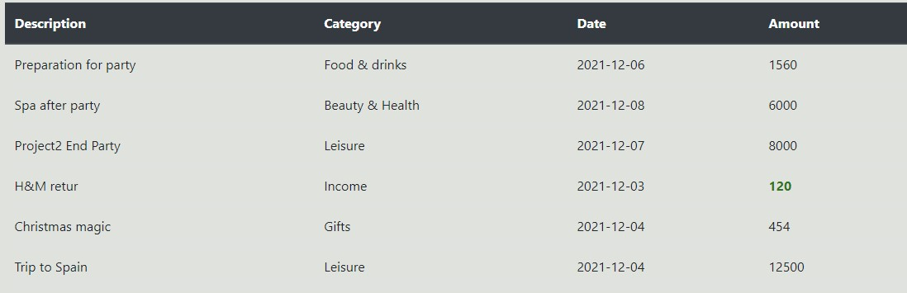

# Budgy

Budgy is an interactive front-end website for tracking the user's financial data. By default it loads some test data in order to demonstrate the website capabilities. This front end is intended to be connected to a data base, which stores the information for multiple users.

# Table of content 
- [Design Decisions](#design-decisions)
    - [Wireframe](#wireframe)
    - [Design choices](#design-choices)
    - [Color palette](#color-palette)
- [User Experience](#user-experience)
    - [Features](#features)
- [Technologies used](#technologies-used)
- [Testig](#testing)
- [Deployment](#deployment)
    - [Project deployment](#project-deployment)
    - [To fork the repository on GitHub](#to-fork-the-repository-on-github)
    - [To create a local clone of this project](#to-create-a-local-clone-of-this-project)
- [Future work](#future-work)
- [Credits](#credits)
- [Media](#media)
- [Acknowledgements](#acknowledgements)

# Design Decisions
## Wireframe
The Wireframe for Budgy was produces using WireFlow. The wireframe's display is for mobile divice and the final design has some changes that occured during the development process.

The design is split in three big parts.
* **dashboard** - this where the user can see the current balance, monthly and weekly expenses.
* **entry-form** - this is where the user registers the entries. 
* **entry-area** - this sections displays all the entries. 

## Design choices
Typography - The font chosen is Roboto, sans-serif.

## Color palette
The chosen colour scheme is one based on yellow and dark tones of gray. This palette points the content out and creates a modern aspect for the website. Moreover gray is traditionally associated with business industry, corporate uniformity and professionalism.

# User Experience
## Features
Each section has different features designed to make the user experience more enjoyble. 

### Dashboard
It is designed to promt user with information about balance, weekly and monthly expenses. **Balance** is defined as the sum of all expenses and incomes. **Weekly** represents the value made in the current week, with first day of the week being Monday. **Monthly** represents the sum of all expenses in the current month. 

User can set its own spending limits on weekly and monthly basis. When the limit is exceeded, the value associated to it will be disaplyed in red. Here is an example where the **monthly** limit was excedeed. The same is true for **weekly** limit as well. 

The user is allowed to increase the limit. If it is increased above the reported expenses, the red style will dynamically dissapear.

### Entry Form
This element is designed to allow the user to register entries. It composed from 5 elements:
* **description** - entry description. Ex, where is the money coming from or where the money was spent.
* **category** - user can choose from `groceries, food&drinks, Beauty&health, leisure, gifts, income`. Category is needed for later entry filtering.
* **date** - date when the entry was processed. Used for later filtering.
* **amount** - entry's amount.
* **button** - the submit button which triggers the form submission.
After submit button is clicked and entry was processed, the form will be cleared to make room for a new request. 

### Entry Area
This elements displays all the entries submitted via the form. At this point it is only for display. The intention is to also provide manipulation over the entries, like filtering capabilities, sorting. 

The entries from **income** category will always be displayed in green to make it more easily noticible by the user. 

### Reset
The website also has a reset button. When this button is pressed, it will clear the dashboard, entry-area and the forms.

# Technologies used

- HTML5 - provides the core structure for the website.
- CSS - styling.
- JavaScript - used to program the behavior of web page.
- Gitpod - used to deploy the website.
- Github - used to host and edit the website.

# Testing

The HTML and CSS code were tested using [W3C HTML Validator](#https://validator.w3.org/), respectively [W3C CSS Validator](#https://jigsaw.w3.org/css-validator/). JavaScript code was tested using [JSHint](#https://jshint.com/).
A few bugs have been found during the development process which were corrected.

## HTML result

## CSS result

## JavaScript result

## Responsiveness
The responsiveness was tested using three different tools:
- Chrome Developer Tools
- http://ami.responsivedesign.is/
- https://www.responsivedesignchecker.com/

## Compatibility
The website was tested on Chrome, Edge, Mozilla Firefox. The functionality and appereance remains unchanged between these three on any device size. 

## Lighthouse
This [tool](#https://developers.google.com/web/tools/lighthouse) was used to test the performance and accesibility. It provided useful information in order to improve accesibility and SEO during creation process. Here are the final results:

## Known issues
1. The calculation for extracting the week number from the entry date in the form, does not always work properly. This leads to faulty weekly reports.
2. The Lighthouse report highlights missing label for the input date in the form. It was a design choice to not set a label text.

# Deployment

## Project deployment
  
The site was deployed to GitHub pages. The steps to deploy a site are:

1. In the GitHub repository, navigate to the Settings tab.
2. Once in Settings, navigate to the Pages tab on the left hand side.
3. Under Source, select the branch to master/main, then click save.
4. The page will be automatically refreshed with a detailed ribbon display to indicate the successful deployment.
  
## To fork the repository on GitHub
  
  A copy of the GitHub Repository can be made by forking the GitHub account. This copy can be viewed and changes can be made to the copy without affecting the original repository. Take the following steps to fork the repository:

  1. Log in to GitHub and locate the repository.
  2. Click on the "Fork" button, located on the right hand site, to create a copy of the original repository in your GitHub Account. 

## To create a local clone of this project
  

  Below are the detaild steps:

  1. Under the repository’s name, click on the code tab.
  2. In the Clone with HTTPS section, click on the clipboard icon to copy the given URL.
   PRINT

   3. In your IDE of choice, open Git Bash.
   4. Change the current working directory to the location where you want the cloned directory to be made.
   5. Type git clone, and then paste the URL copied from GitHub.
   6. Press enter and the local clone will be created.

# Credits
- Google Fonts 
- W3 Schools
- Stack Overflow
- CSS Tricks
- MDN WEB DOCS 
- coolors.co  
# Media
-
# Acknowledgements

